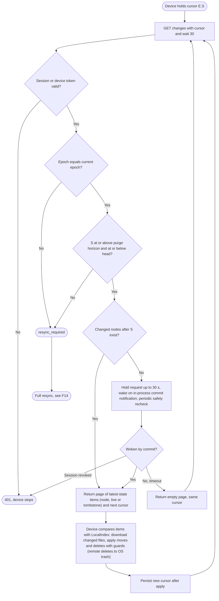

# Flow F7: Change-feed long-poll sync and cursor epoch.seq

Details, preconditions and errors: [system-flows.md](../../system-flows.md#flow-f7-change-feed-long-poll-sync)

```mermaid
flowchart TD
    start([Device holds cursor E.S]) --> poll["GET changes with cursor and wait 30"]
    poll --> auth{"Session or device token valid?"}
    auth -->|No| unauth([401, device stops])
    auth -->|Yes| epoch{"Epoch equals current epoch?"}
    epoch -->|No| resync([resync_required])
    epoch -->|Yes| range{"S at or above purge horizon and at or below head?"}
    range -->|No| resync
    range -->|Yes| ready{"Changed nodes after S exist?"}
    ready -->|Yes| page["Return page of latest-state items (node, live or tombstone) and next cursor"]
    ready -->|No| hold["Hold request up to 30 s, wake on in-process commit notification, periodic safety recheck"]
    hold --> wake{"Woken by commit?"}
    wake -->|Yes| page
    wake -->|"No, timeout"| empty["Return empty page, same cursor"]
    wake -->|"Session revoked"| unauth
    page --> apply["Device compares items with LocalIndex: download changed files, apply moves and deletes with guards (remote deletes to OS trash)"]
    apply --> save["Persist new cursor after apply"]
    save --> poll
    empty --> poll
    resync --> full([Full resync, see F14])
```
