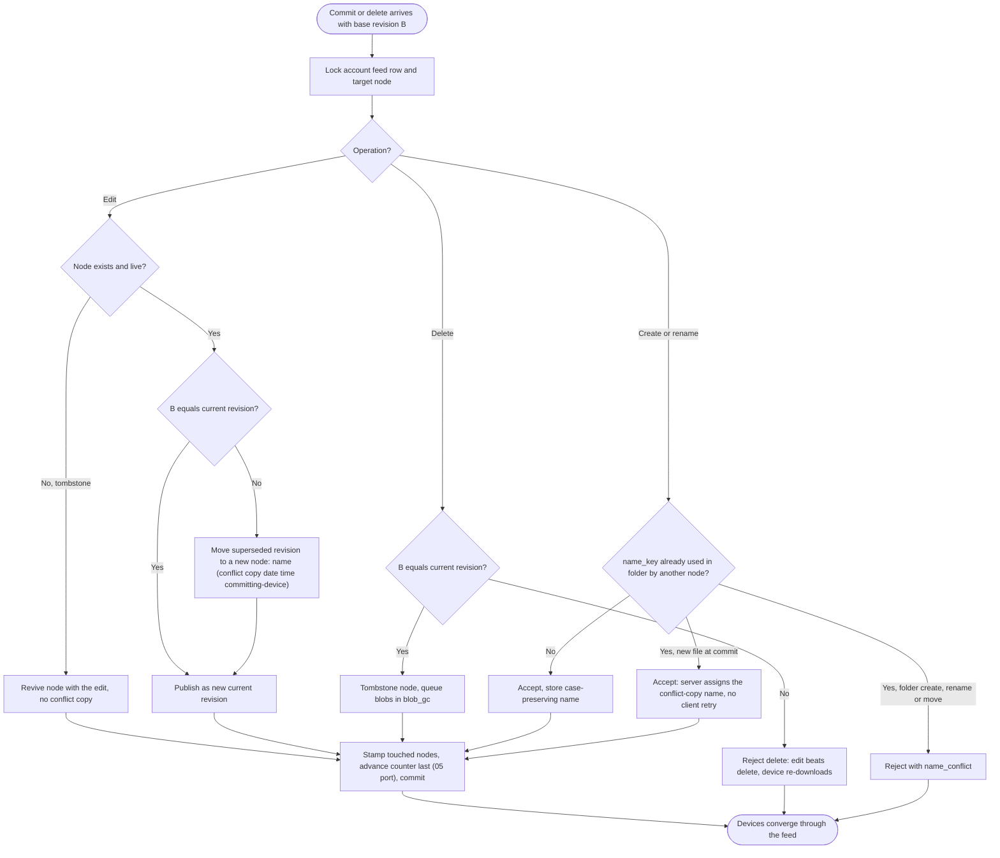

# Flow F8: Conflict handling

Details, preconditions and errors: [system-flows.md](../../system-flows.md#flow-f8-conflict-handling)

```mermaid
flowchart TD
    commit([Commit or delete arrives with base revision B]) --> lock["Lock account feed row and target node"]
    lock --> kind{"Operation?"}
    kind -->|Edit| exists{"Node exists and live?"}
    exists -->|"No, tombstone"| revive["Revive node with the edit, no conflict copy"]
    exists -->|Yes| base{"B equals current revision?"}
    base -->|Yes| publish["Publish as new current revision"]
    base -->|No| stale["Move superseded revision to a new node: name (conflict copy date time committing-device)"]
    stale --> publish
    kind -->|Delete| delbase{"B equals current revision?"}
    delbase -->|Yes| tomb["Tombstone node, queue blobs in blob_gc"]
    delbase -->|No| keep["Reject delete: edit beats delete, device re-downloads"]
    kind -->|"Create or rename"| nameKey{"name_key already used in folder by another node?"}
    nameKey -->|No| ok["Accept, store case-preserving name"]
    nameKey -->|"Yes, new file at commit"| collide["Accept: server assigns the conflict-copy name, no client retry"]
    nameKey -->|"Yes, folder create, rename or move"| reject["Reject with name_conflict"]
    revive --> event
    publish --> event["Stamp touched nodes, advance counter last (05 port), commit"]
    tomb --> event
    ok --> event
    event --> done([Devices converge through the feed])
    keep --> done
    collide --> event
    reject --> done
```
