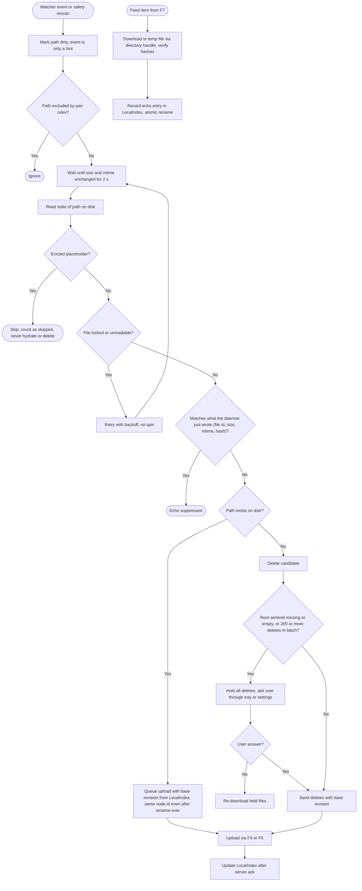

# Flow F9: Desktop watcher cycle

Details, preconditions and errors: [system-flows.md](../../system-flows.md#flow-f9-desktop-watcher-cycle)

```mermaid
flowchart TD
    ev([Watcher event or safety rescan]) --> hint["Mark path dirty, event is only a hint"]
    hint --> excl{"Path excluded by pair rules?"}
    excl -->|Yes| skip([Ignore])
    excl -->|No| settle["Wait until size and mtime unchanged for 2 s"]
    settle --> state["Read state of path on disk"]
    state --> ph{"Evicted placeholder?"}
    ph -->|Yes| report([Skip, count as skipped, never hydrate or delete])
    ph -->|No| locked{"File locked or unreadable?"}
    locked -->|Yes| retry["Retry with backoff, no spin"]
    retry --> settle
    locked -->|No| echo{"Matches what the daemon just wrote (file id, size, mtime, hash)?"}
    echo -->|Yes| drop([Echo suppressed])
    echo -->|No| exists{"Path exists on disk?"}
    exists -->|Yes| up["Queue upload with base revision from LocalIndex, same node id even after rename-over"]
    exists -->|No| del["Delete candidate"]
    del --> guard{"Root sentinel missing or empty, or 200 or more deletes in batch?"}
    guard -->|Yes| hold["Hold all deletes, ask user through tray or settings"]
    hold --> answer{"User answer?"}
    answer -->|No| redl["Re-download held files"]
    answer -->|Yes| sendDel["Send deletes with base revision"]
    guard -->|No| sendDel
    up --> sync["Upload via F4 or F5"]
    sendDel --> sync
    sync --> idx["Update LocalIndex after server ack"]

    feed([Feed item from F7]) --> dl["Download to temp file via directory handle, verify hashes"]
    dl --> rec["Record echo entry in LocalIndex, atomic rename"]
```
