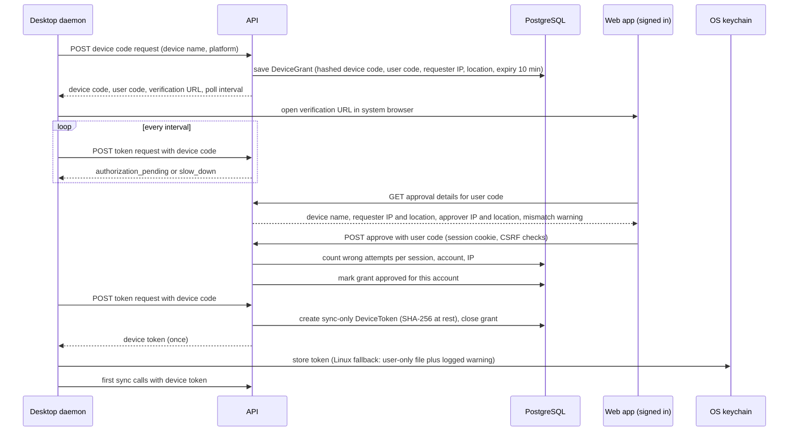

# Flow F3: Desktop device-code login and approval page

Details, preconditions and errors: [system-flows.md](../../system-flows.md#flow-f3-desktop-device-code-login-and-approval)

```mermaid
sequenceDiagram
    participant Daemon as Desktop daemon
    participant API
    participant PostgreSQL
    participant Browser as Web app (signed in)
    participant Keychain as OS keychain

    Daemon->>API: POST device code request (device name, platform)
    API->>PostgreSQL: save DeviceGrant (hashed device code, user code, requester IP, location, expiry 10 min)
    API-->>Daemon: device code, user code, verification URL, poll interval
    Daemon->>Browser: open verification URL in system browser
    loop every interval
        Daemon->>API: POST token request with device code
        API-->>Daemon: authorization_pending or slow_down
    end
    Browser->>API: GET approval details for user code
    API-->>Browser: device name, requester IP and location, approver IP and location, mismatch warning
    Browser->>API: POST approve with user code (session cookie, CSRF checks)
    API->>PostgreSQL: count wrong attempts per session, account, IP
    API->>PostgreSQL: mark grant approved for this account
    Daemon->>API: POST token request with device code
    API->>PostgreSQL: create sync-only DeviceToken (SHA-256 at rest), close grant
    API-->>Daemon: device token (once)
    Daemon->>Keychain: store token (Linux fallback: user-only file plus logged warning)
    Daemon->>API: first sync calls with device token
```
