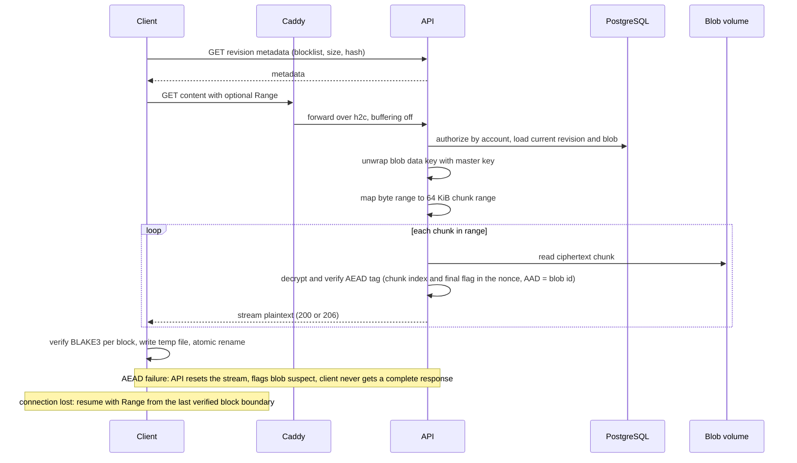

# Flow F6: Download with Range and decrypt streaming

Details, preconditions and errors: [system-flows.md](../../system-flows.md#flow-f6-download)

```mermaid
sequenceDiagram
    participant Client
    participant Caddy
    participant API
    participant PostgreSQL
    participant Blobs as Blob volume

    Client->>API: GET revision metadata (blocklist, size, hash)
    API-->>Client: metadata
    Client->>Caddy: GET content with optional Range
    Caddy->>API: forward over h2c, buffering off
    API->>PostgreSQL: authorize by account, load current revision and blob
    API->>API: unwrap blob data key with master key
    API->>API: map byte range to 64 KiB chunk range
    loop each chunk in range
        API->>Blobs: read ciphertext chunk
        API->>API: decrypt and verify AEAD tag (chunk index and final flag in the nonce, AAD = blob id)
        API-->>Client: stream plaintext (200 or 206)
    end
    Client->>Client: verify BLAKE3 per block, write temp file, atomic rename
    Note over API,Client: AEAD failure: API resets the stream, flags blob suspect, client never gets a complete response
    Note over Client: connection lost: resume with Range from the last verified block boundary
```
