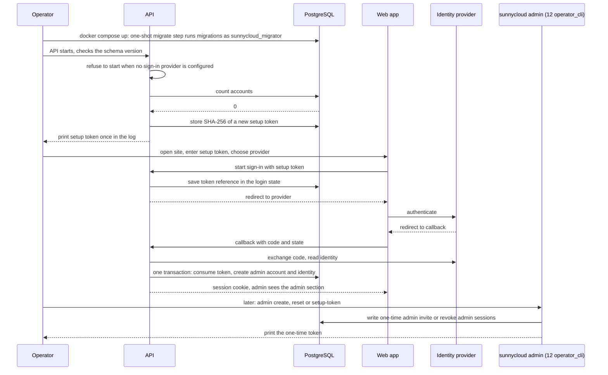

# Flow F1: First-run bootstrap

Details, preconditions and errors: [system-flows.md](../../system-flows.md#flow-f1-first-run-bootstrap)

```mermaid
sequenceDiagram
    participant Operator
    participant API
    participant PostgreSQL
    participant Web as Web app
    participant IdP as Identity provider
    participant CLI as sunnycloud admin (12 operator_cli)

    Operator->>PostgreSQL: docker compose up: one-shot migrate step runs migrations as sunnycloud_migrator
    Operator->>API: API starts, checks the schema version
    API->>API: refuse to start when no sign-in provider is configured
    API->>PostgreSQL: count accounts
    PostgreSQL-->>API: 0
    API->>PostgreSQL: store SHA-256 of a new setup token
    API-->>Operator: print setup token once in the log
    Operator->>Web: open site, enter setup token, choose provider
    Web->>API: start sign-in with setup token
    API->>PostgreSQL: save token reference in the login state
    API-->>Web: redirect to provider
    Web->>IdP: authenticate
    IdP-->>Web: redirect to callback
    Web->>API: callback with code and state
    API->>IdP: exchange code, read identity
    API->>PostgreSQL: one transaction: consume token, create admin account and identity
    API-->>Web: session cookie, admin sees the admin section
    Operator->>CLI: later: admin create, reset or setup-token
    CLI->>PostgreSQL: write one-time admin invite or revoke admin sessions
    CLI-->>Operator: print the one-time token
```
