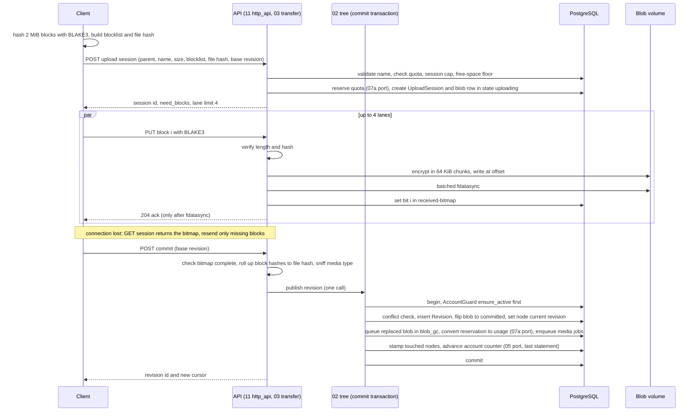

# Flow F4: Large-file upload

Details, preconditions and errors: [system-flows.md](../../system-flows.md#flow-f4-large-file-upload)

```mermaid
sequenceDiagram
    participant Client
    participant API as API (11 http_api, 03 transfer)
    participant Tree as 02 tree (commit transaction)
    participant PostgreSQL
    participant Blobs as Blob volume

    Client->>Client: hash 2 MiB blocks with BLAKE3, build blocklist and file hash
    Client->>API: POST upload session (parent, name, size, blocklist, file hash, base revision)
    API->>PostgreSQL: validate name, check quota, session cap, free-space floor
    API->>PostgreSQL: reserve quota (07a port), create UploadSession and blob row in state uploading
    API-->>Client: session id, need_blocks, lane limit 4
    par up to 4 lanes
        Client->>API: PUT block i with BLAKE3
        API->>API: verify length and hash
        API->>Blobs: encrypt in 64 KiB chunks, write at offset
        API->>Blobs: batched fdatasync
        API->>PostgreSQL: set bit i in received-bitmap
        API-->>Client: 204 ack (only after fdatasync)
    end
    Note over Client,API: connection lost: GET session returns the bitmap, resend only missing blocks
    Client->>API: POST commit (base revision)
    API->>API: check bitmap complete, roll up block hashes to file hash, sniff media type
    API->>Tree: publish revision (one call)
    Tree->>PostgreSQL: begin, AccountGuard ensure_active first
    Tree->>PostgreSQL: conflict check, insert Revision, flip blob to committed, set node current revision
    Tree->>PostgreSQL: queue replaced blob in blob_gc, convert reservation to usage (07a port), enqueue media jobs
    Tree->>PostgreSQL: stamp touched nodes, advance account counter (05 port, last statement)
    Tree->>PostgreSQL: commit
    API-->>Client: revision id and new cursor
```
