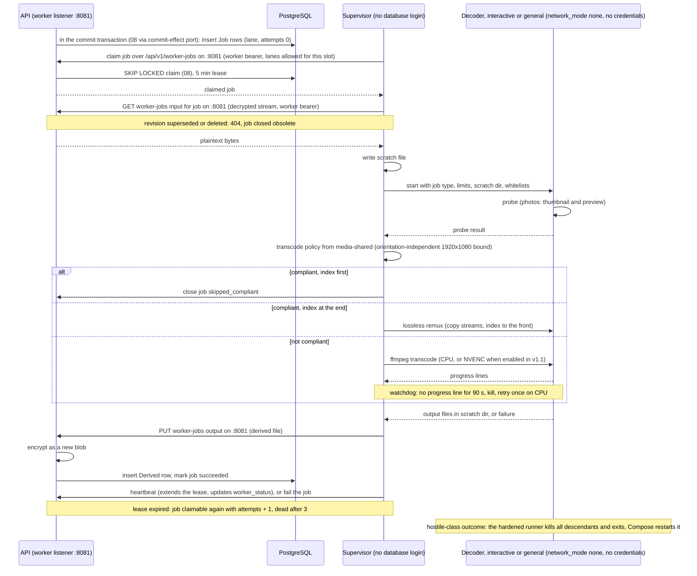

# Flow F10: Media pipeline

Details, preconditions and errors: [system-flows.md](../../system-flows.md#flow-f10-media-pipeline)

```mermaid
sequenceDiagram
    participant API as API (worker listener :8081)
    participant PostgreSQL
    participant Sup as Supervisor (no database login)
    participant Dec as Decoder, interactive or general (network_mode none, no credentials)

    API->>PostgreSQL: in the commit transaction (08 via commit-effect port): insert Job rows (lane, attempts 0)
    Sup->>API: claim job over /api/v1/worker-jobs on :8081 (worker bearer, lanes allowed for this slot)
    API->>PostgreSQL: SKIP LOCKED claim (08), 5 min lease
    API-->>Sup: claimed job
    Sup->>API: GET worker-jobs input for job on :8081 (decrypted stream, worker bearer)
    Note over Sup,API: revision superseded or deleted: 404, job closed obsolete
    API-->>Sup: plaintext bytes
    Sup->>Sup: write scratch file
    Sup->>Dec: start with job type, limits, scratch dir, whitelists
    Dec->>Dec: probe (photos: thumbnail and preview)
    Dec-->>Sup: probe result
    Sup->>Sup: transcode policy from media-shared (orientation-independent 1920x1080 bound)
    alt compliant, index first
        Sup->>API: close job skipped_compliant
    else compliant, index at the end
        Sup->>Dec: lossless remux (copy streams, index to the front)
    else not compliant
        Sup->>Dec: ffmpeg transcode (CPU, or NVENC when enabled in v1.1)
        Dec-->>Sup: progress lines
        Note over Sup,Dec: watchdog: no progress line for 90 s, kill, retry once on CPU
    end
    Dec-->>Sup: output files in scratch dir, or failure
    Sup->>API: PUT worker-jobs output on :8081 (derived file)
    API->>API: encrypt as a new blob
    API->>PostgreSQL: insert Derived row, mark job succeeded
    Sup->>API: heartbeat (extends the lease, updates worker_status), or fail the job
    Note over Sup,API: lease expired: job claimable again with attempts + 1, dead after 3
    Note over Dec: hostile-class outcome: the hardened runner kills all descendants and exits, Compose restarts it
```
