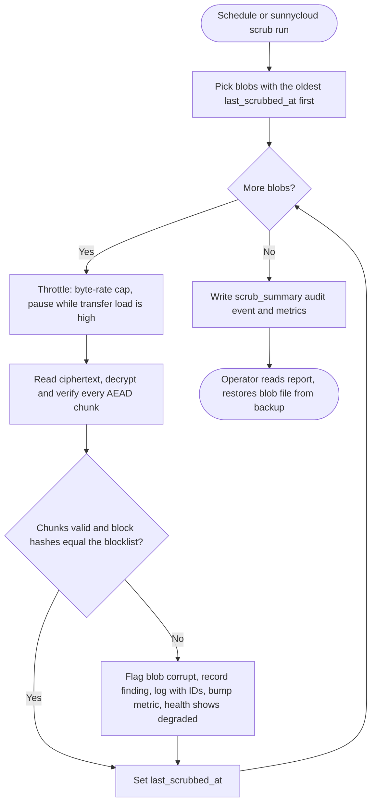

# Flow F15: Scrub

Details, preconditions and errors: [system-flows.md](../../system-flows.md#flow-f15-scrub)

```mermaid
flowchart TD
    trig([Schedule or sunnycloud scrub run]) --> pos["Pick blobs with the oldest last_scrubbed_at first"]
    pos --> next{"More blobs?"}
    next -->|No| finish["Write scrub_summary audit event and metrics"]
    next -->|Yes| thr["Throttle: byte-rate cap, pause while transfer load is high"]
    thr --> rd["Read ciphertext, decrypt and verify every AEAD chunk"]
    rd --> hashes{"Chunks valid and block hashes equal the blocklist?"}
    hashes -->|Yes| save["Set last_scrubbed_at"]
    save --> next
    hashes -->|No| mark["Flag blob corrupt, record finding, log with IDs, bump metric, health shows degraded"]
    mark --> save
    finish --> done([Operator reads report, restores blob file from backup])
```
