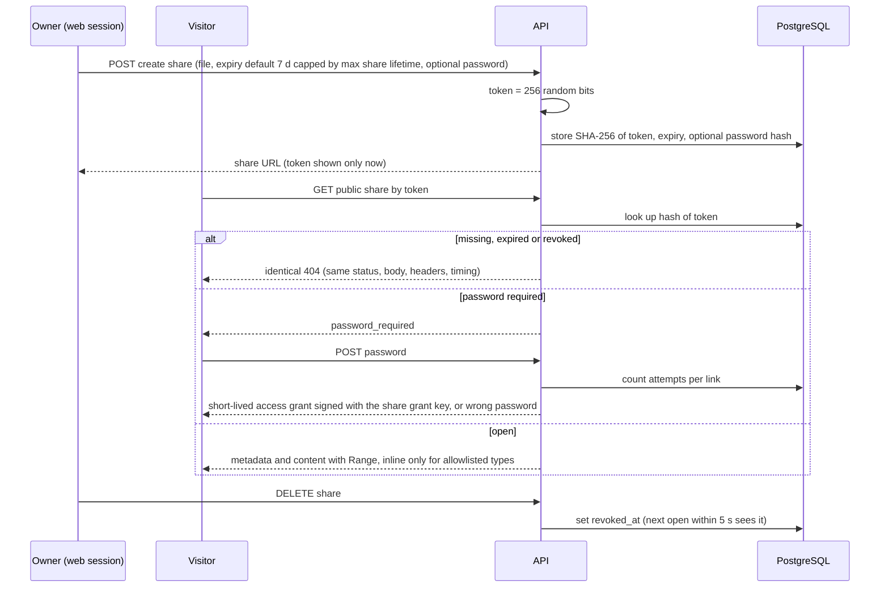

# Flow F11: Share link create, open, revoke

Details, preconditions and errors: [system-flows.md](../../system-flows.md#flow-f11-share-link-create-open-revoke)

```mermaid
sequenceDiagram
    participant Owner as Owner (web session)
    participant Visitor
    participant API
    participant PostgreSQL

    Owner->>API: POST create share (file, expiry default 7 d capped by max share lifetime, optional password)
    API->>API: token = 256 random bits
    API->>PostgreSQL: store SHA-256 of token, expiry, optional password hash
    API-->>Owner: share URL (token shown only now)
    Visitor->>API: GET public share by token
    API->>PostgreSQL: look up hash of token
    alt missing, expired or revoked
        API-->>Visitor: identical 404 (same status, body, headers, timing)
    else password required
        API-->>Visitor: password_required
        Visitor->>API: POST password
        API->>PostgreSQL: count attempts per link
        API-->>Visitor: short-lived access grant signed with the share grant key, or wrong password
    else open
        API-->>Visitor: metadata and content with Range, inline only for allowlisted types
    end
    Owner->>API: DELETE share
    API->>PostgreSQL: set revoked_at (next open within 5 s sees it)
```
