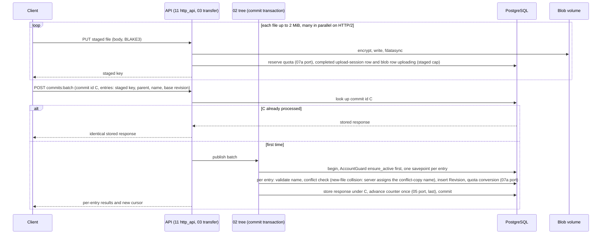

# Flow F5: Small-file single-request upload and batch commit

Details, preconditions and errors: [system-flows.md](../../system-flows.md#flow-f5-small-file-upload-and-batch-commit)

```mermaid
sequenceDiagram
    participant Client
    participant API as API (11 http_api, 03 transfer)
    participant Tree as 02 tree (commit transaction)
    participant PostgreSQL
    participant Blobs as Blob volume

    loop each file up to 2 MiB, many in parallel on HTTP/2
        Client->>API: PUT staged file (body, BLAKE3)
        API->>Blobs: encrypt, write, fdatasync
        API->>PostgreSQL: reserve quota (07a port), completed upload-session row and blob row uploading (staged cap)
        API-->>Client: staged key
    end
    Client->>API: POST commits:batch (commit id C, entries: staged key, parent, name, base revision)
    API->>PostgreSQL: look up commit id C
    alt C already processed
        PostgreSQL-->>API: stored response
        API-->>Client: identical stored response
    else first time
        API->>Tree: publish batch
        Tree->>PostgreSQL: begin, AccountGuard ensure_active first, one savepoint per entry
        Tree->>PostgreSQL: per entry: validate name, conflict check (new-file collision: server assigns the conflict-copy name), insert Revision, quota conversion (07a port)
        Tree->>PostgreSQL: store response under C, advance counter once (05 port, last), commit
        API-->>Client: per-entry results and new cursor
    end
```
