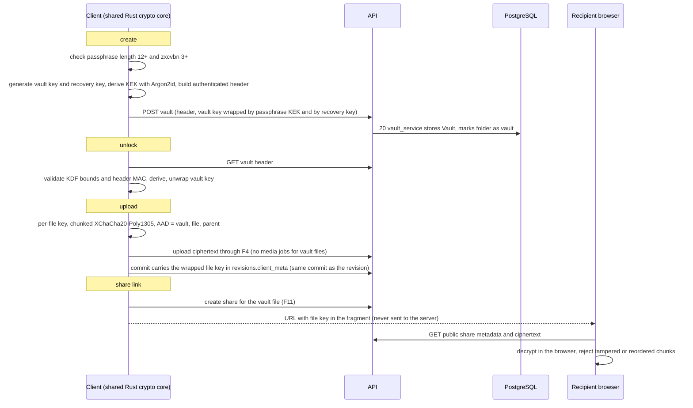

# Flow F17: Vault [v1.2]

Details, preconditions and errors: [system-flows.md](../../system-flows.md#flow-f17-vault-v12)

```mermaid
sequenceDiagram
    participant Client as Client (shared Rust crypto core)
    participant API
    participant PostgreSQL
    participant Recipient as Recipient browser

    Note over Client: create
    Client->>Client: check passphrase length 12+ and zxcvbn 3+
    Client->>Client: generate vault key and recovery key, derive KEK with Argon2id, build authenticated header
    Client->>API: POST vault (header, vault key wrapped by passphrase KEK and by recovery key)
    API->>PostgreSQL: 20 vault_service stores Vault, marks folder as vault
    Note over Client: unlock
    Client->>API: GET vault header
    Client->>Client: validate KDF bounds and header MAC, derive, unwrap vault key
    Note over Client: upload
    Client->>Client: per-file key, chunked XChaCha20-Poly1305, AAD = vault, file, parent
    Client->>API: upload ciphertext through F4 (no media jobs for vault files)
    Client->>API: commit carries the wrapped file key in revisions.client_meta (same commit as the revision)
    Note over Client: share link
    Client->>API: create share for the vault file (F11)
    Client-->>Recipient: URL with file key in the fragment (never sent to the server)
    Recipient->>API: GET public share metadata and ciphertext
    Recipient->>Recipient: decrypt in the browser, reject tampered or reordered chunks
```
